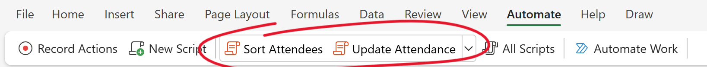

# 🧗UNMC-Climbers
Office Scripts for the UNM Rock Climbing Club to select members, create sheets, and update attendance for our weekly indoor climbs.

## ⚙️ Setting Up

1. **Open an Excel Workbook**
   - Ensure you are signed in with your university account.

2. **Create a New Script**
   - Click on the **Automate** tab.
   - Select **New Script**.

3. **Add the Sort Attendees Script**
   - Remove all existing code in the editor.
   - Copy and paste the contents of `sortAttendees.osts`.
   - Rename the script to **Sort Attendees**.
   - Save the script.

4. **Add the Update Attendance Script**
   - Repeat the same steps for `updateAttendance.osts`.
   - Rename the script to **Update Attendance**.
   - Save the script.

Now, both scripts should appear in the ribbon and can be run anytime directly from Excel.

## 📋Sort Attendees

### How to Sort Attendees
1. **Open the live Excel sheet containing form responses**

2. **Insert an attendance table from the previous *Attendees* sheet below the signups table**  
   - Ensure that it comes from the right sheet **(not Sheet1)** and occupies **columns A and B**.  
   - If it's the first climb, add headers **Name** and **No. of Climbers**

     
   - Otherwise, it should resemble this:  
     
     

3. **Run the script**
   - Checkboxes should be added manually.

   

###  Sorting Process and Results
**Scenario 1:** 20 or Fewer Signups
- A new sheet **Attendees** is created
- No selection process is applied

**Scenario 2:** More than 20 Signups
- 2 new sheets **Attendees** and **Sorting** are created
- The **Sorting** sheet displays the selection process using the following criteria:

   1. **Passengers** are sorted from least to most climbs.
   2. Further sorted by **skill**, prioritizing those who have never been taught to belay and tie a figure-eight knot.
   3. The first 10 are selected as a priority.
   4. The remaining spots are filled on a **first-come, first-served basis**.
   5. **Drivers and self-transport members are automatically included**, so the final passenger count follows:  
       `maxMembers - (number of drivers + number of self-transport members)`

### Adjusting Code Values
`maxMembers` defines the maximum number of members that can be accomodated (Default 20) 
`maxUnskilled` defines how many members who don't know how to belay or tie a figure-eight knot can be accomodated for training (Default 10)  
 
These variables are at the very top of the script for ease of access and can be modified.

## 📈 Update Attendance
1) **Run the script**

2) Check the new table for multiple names referring to the same person and update accordingly.

  
**All done!** Future committee members can make changes to improve the scripts, contact me to be added as a collaborator.😊